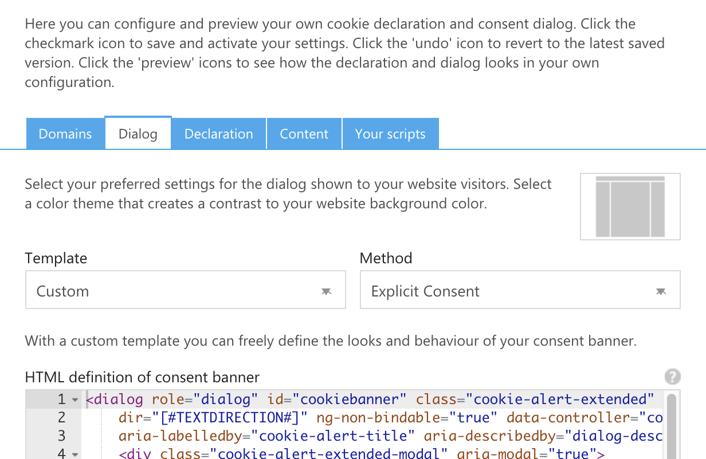
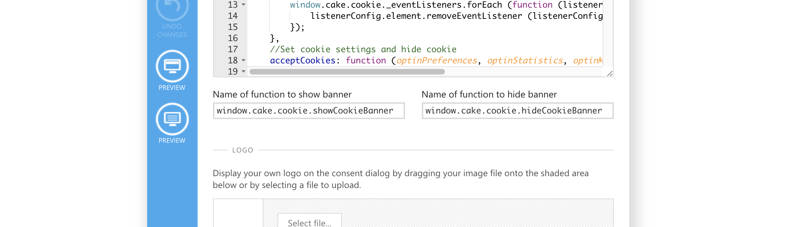
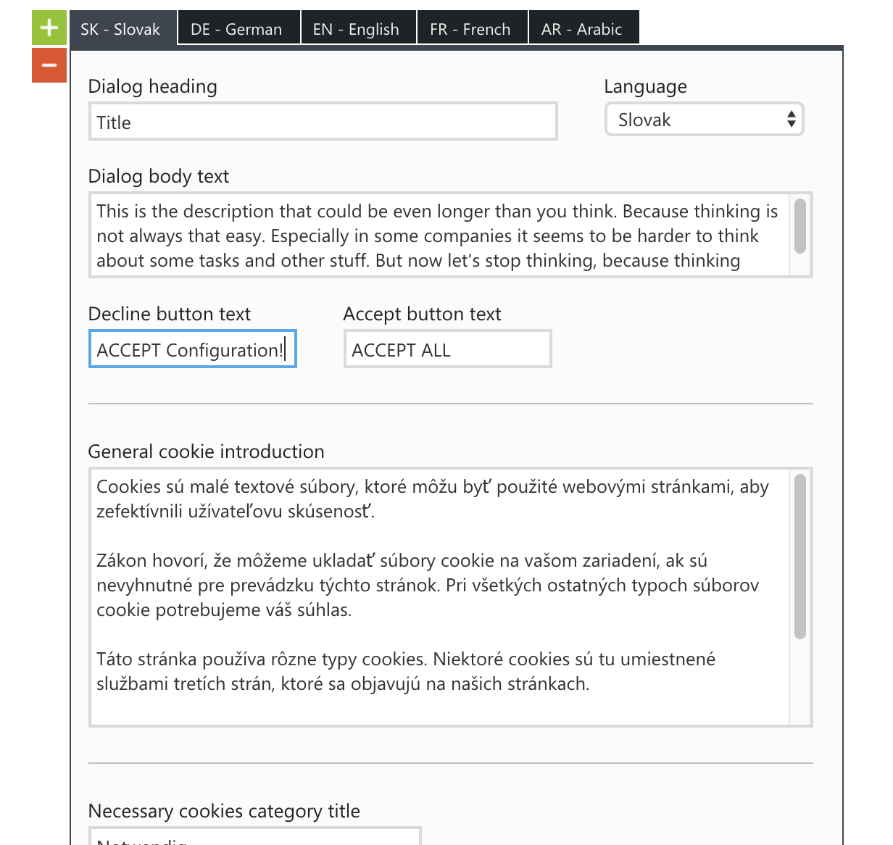

# CookieBot

## Set up the template

We have developed our cookie alert especially for the [CookieBot website](https://cookiebot.com/). This means that this component also works with the [CookieBot console](https://manage.cookiebot.com/en/manage).

To set our component as your cookie-bot consent, just log into your [CookieBot console](https://manage.cookiebot.com/en/manage) and switch to the Domain group you'd like to adjust. In this dashboard you have to switch to the *Dialog* tab.
There you have to set the *Template* to `Custom` and the *Method* to `Explicit Consent` like in the following example. Depending on your language these fields could have a different name.

Afterwards you should be able to see 3 different textareas:

* HTML
* CSS
* JavaScript

You can simply copy our sourcecode templates from the textareas below into the appropriate field.

### HTML

### CSS

To prevent doubled CSS code, the following CSS should only be entered into the Cookiebot console if the CSS has not already been included independently. This is the case if the `cake(.min).css` or `cake-cookiebot(.min).css` file was used.
Otherwise the CSS would be included twice, which increases the page load time. Simply add `/* NO CSS */` to the appropriate field. If this field is left empty, Cookiebot will apply their own stylings again.

### JavaScript

The following JavaScript should only be entered into the Cookiebot-Console if the js has not already been included independently. This is the case if the `cake(.min).js` or `cookieAlert(.min).js` file was used. **You should add `// NO JS` to the appropriate field to not load additional JavaScript from Cookiebot which will break the functionality.** If this field is left empty, Cookiebot will apply their own JavaScript again.

_Brief notes_: If you include the JavaScript or CSS of the Cookiebot yourself and not through the Cookiebot Console, the preview function of the Console cannot be used. Instead, the functionality should be tested directly with the implementation.

In addition you have to adjust the `Name of function to show alert` and the `Name of function to hide alert` with the following values like in the screenshot below:

* Name of function to show alert: `window.cake.cookie.showCookieAlert`
* Name of function to show alert without forcing the browser focus to stay on the exetended cookie alert: `window.cake.cookie.showCookieAlertWithoutForcedFocus`
* Name of function to hide alert: `window.cake.cookie.hideCookieAlert`

## Set up the content

You can enter the content for our component as usual via the [CookieBot console](https://manage.cookiebot.com/en/manage). To do this, switch to the content tab and then create the texts, if not already done.

> ### Special exception when maintaining the content!
>
> But you have to pay attention to a special exception when maintaining the content! The field `Decline button text` is not the text for a reject button, but for the button `accept configuration`.
> This had to be solved this way, because CookieBot unfortunately does not allow any further individual text fields.

