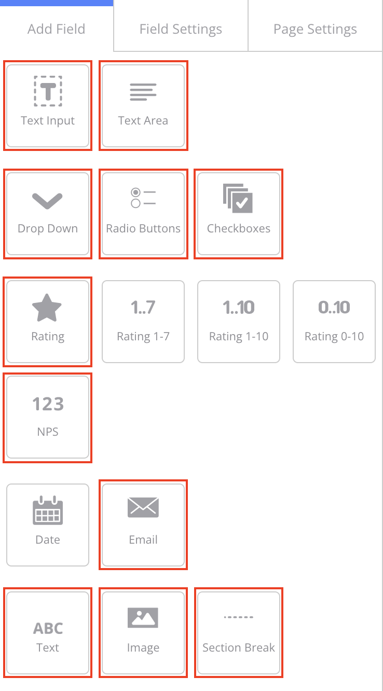

# Medallia surveys

With medallia you can create surveys to get feedback from real users. There are different ways of implementing such surveys. Read more at [trigger types](#trigger-types).

## Medallia interface

To create a survey you have to log into the Medallia Interface with your Digital Admin role. Afterwards navigate to the "Admin Suite" and click on "Digital".
Now please navigate to the property where you want to add your new survey. You will see the active property in the top right corner. It simply shows the domain of the active property. To switch to any other property, click the dropdown menu and select "Switch Property". Select the desired property and click on "Apply" to switch.
To see all surveys that exist, navigate on the left hand side to "Forms".

## Use our templates

If you want to create an embedded survey, **please read the complete documentation first**, so as not to forget anything important. If you are already familiar with the documentation and don't want to make all the settings yourself every time, you can copy one of our templates `TEST - CAKE Embedded Survey - Template` or `TEST - CAKE Invite Survey - Template` and just adapt it. Just hover over the survey, click on the advanced submenu (the three dots) and select "Duplicate". Then you can give your new survey a name and customize your new survey accordingly.

## Create surveys

To create a new survey simply click on "New Form" on the right hand side. Give it an appropriate name and chose the language. The form will be created and you will automatically start within the form editor. Now click on "Form Settings" and set the following options:

1. Set the "Navigation Buttons" dropdown by selecting "Submit" to ensure we only have a submit button in the form. The close button would be hidden anyway.
1. In the "Form Design"-Tab you have to set the url to our custom CSS in order to apply our LIDL stylings to the form. Simply paste our CDN url into the input field "Custom CSS". `https://www.lidl.de/cdn/assets/npm/@cake-hub/lidl-web-bootstrap_theme/6.9.0/cake-medallia-surveys.min.css`
1. Click on "Save Changes" to apply the changes to your form.

After applying these settings you have set up all required configuration in order to start creating your survey. As a default the form has the left-aligned layout. If you'd like to have a centered layout, you have to set up one more option.

1. Navigate to the "Page Settings"-Tab in the left navigation panel.
1. You will find the input field "Custom CSS Class". On each page you'd like to have the centered layout, you have to input the value `cake-medallia-survey--centered`.
1. Click "Save" on the top right corner and you will have a centered layout.

Now you can finally start to create the survey with all it's questions and fields.
We provide stylings for many of the form fields in that list. In the following image the red squares mark the available elements:

* Text input
* Text area (multiline)
* Dropdown
* Radio buttons
* Checkboxes
* Rating (Thumbs, Numbers, Stars, Smilies)
* NPS
* Email
* Text (with it's text-styles)
* Image
* Section break

You can simply add the fields you need, set up the correct values and logic that you survey requires. The only sepcial field is the "Rating" field. Here you can select the rating "Format".

> __Note:__ The last option "Rating bars" is used to display the thumbs rating. This is because medallia natively does not offer a thumb rating. Therefore, if you want to offer such a thumb rating, just use the last option.

> __Note:__ Please __don't__ use `italic` or `underline` text styles, also try to avoid headline level 6 (`h6`). This things do not match the CAKE standards.

> __Note:__ Images fill the full width of the form up to a maximum width. If the image is to be larger than the maximum width, you can set the "Custom CSS Class" `cake-medallia-survey--unstyled` in the image element.

> __Note:__ In the form editor the elements will have the "native" medallia styling. But you can see the LIDL stylings applied to the elements by clicking on "Preview" in the top right corner.

Finally your survey could look like in our example

<ContentRack
    fields='
        "preview": {
            "src": "examples/EmbeddedSurveyOnly.html",
            "type": "link"
        }
    '
 />

## Implement surveys

After you have created a survey, it still needs to be implemented in your site, of course. To be able to play the polls on your website later, you need your "Digital embed code". This code is a unique script-tag for each property. You can find the required code in the top right corner when you click on your active property. In the dropdown select "Digital embed code" and copy the script-tag. 
Now add the "Digital embed code" to the HTML of your website. There are different methods to include the medallia script into your webpage. Please read the [Integration guide](https://docs.medallia.com/en/medallia-digital/medallia-digital-web/integration-guide) for more information on this topic. Your embed code could look like this ``.

## Trigger types

There are four different types of triggers. These triggers can be used to request feedback from customers in a variety of ways.

### Embedded in page

Embedded surveys which as the name suggests can be embedded directly into the user interface of a website or app. This way you can ask users about their feedback without negatively affecting the user experience by linking to an external page or popup.

To select the embedded trigger type, you need to go back to the surveys overview and follow these steps.

1. Navigate back to "Forms" and hover your currently created form. Click on the "Configure Targeting Options" in your forms tile. 
1. To enable the embedding in your website, select on the bottom left corner "Embedded in Page". 
1. Now you have to configure an identifier that you will later use to tell medallia, which element should contain the embedded survey. Therefore chose an appropriate "Page Element ID" and note it for later use. In our example we use the ID `cake_medallia_embedded_survey`. 
1. Now you can click on "Save Changes" to store your custom configuration.

For this type of surveys you need to set an additional setting in the survey itself. To do this, go back to the form settings, navigate to the "Basic settings" tab and select verify that the "Take up entire Hosting HTML Element width" option is set. 

With all the options configured and having already added the "Digital embed code" to your page, implement your embedded survey with the following steps:

1. To use the embedded surveys feature you have to tell medallia where to place the survey. Therefore you need to add a `div` element to your webpage with the correct "Page Element ID" set as `id` property. In our example it will look like `

`.
1. If you would like to add custom behavior such as automatically removing the survey from your webpage after it has been submitted you can use our custom JavaScript which is located in the file named [cake-medallia-surveys.js](https://raw.githubusercontent.com/cake-hub/lidl-web-bootstrap_theme/master/Container/dist/js/cake-medallia-surveys.min.js). By using this file you will have the two events `cake-medallia.OnSurveyLoaded` & `cake-medallia.OnSurveySubmitted` to implement your custom functionality.
1. If you use the centered layout (class `cake-medallia-survey--centered`), you could also set the width of the page element so that you can customize the appearance of the survey. Therefore simply set the `max-width` style attribute to the desired width. eg. `

`

When you implement the embedded survey into your webpage, it could look like the following example.

<ContentRack
    fields='
        "preview": {
            "src": "examples/ExamplePageWithMedallia.html",
            "type": "link"
        },
        "<HTML>":{
            "src": "assets/example.html",
            "type": "content",
            "selector": "#app"
        },
        "JS":{
            "src": "assets/example.js",
            "type": "content"
        }
    '
 />

> __Note:__ The responsive breakpoints may differ from the prescribed breakpoints, since the I-frame may have a different size than the entire page, depending on the implementation.

### Invitation trigger

Surveys of the "Invitation" trigger type can be used to ask customers for feedback using popups. The customer is asked whether he wants to give feedback. This can be set again via the "Configure Targeting Options". More about the Invitation triggers can be found in the Medallia documentation: [Invitation trigger options](https://docs.medallia.com/en/medallia-digital/medallia-digital-web/administration-guide/targeting-surveys/invitation-trigger-options).

However, to set the right configuration to display the appropriate design, you still need to set the following three settings. Therefore navigate to the "Advanced" tab.

1. Set the url to our custom CSS in order to apply our LIDL stylings to the invitation popup. Simply paste our CDN url into the input field `Use a custom CSS file`: `https://www.lidl.de/cdn/assets/npm/@cake-hub/lidl-web-bootstrap_theme/6.9.0/cake-medallia-surveys-invitation.min.css`
1. Set a width of `700px` through the `Invitation width (px)` field.
1. You also need to set the height of the Invitation dialog with the `Invitation height (px)` field. However, the height depends on the length of the content. For a one-line text we recommend a height of `260px` and for two-line content `300px`. However, always check the final result and adjust these values if necessary. Also, always pay attention to the mobile display and reduce the length of the content to the most necessary, so that no content is hidden.

<ContentRack
    fields='
        "preview": {
            "src": "examples/ExampleInviteSurvey.html",
            "type": "link"
        }
    '
 />

### Button trigger

The trigger button will display a corresponding button on your website. A user can provide feedback by clicking on the button. However, the design options for this trigger type are limited and only a "button" image can be uploaded. More about this under [Button trigger options](https://docs.medallia.com/en/medallia-digital/medallia-digital-web/administration-guide/targeting-surveys/button-trigger-options).

### Code trigger

With the "Code trigger" you can control the display of surveys completely independently and develop your own logic. Find more on this topic in the Medallia documentation [Code-based triggers](https://docs.medallia.com/en/medallia-digital/medallia-digital-web/administration-guide/targeting-surveys/code-based-triggers).
