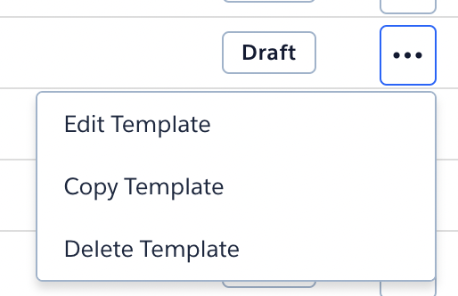
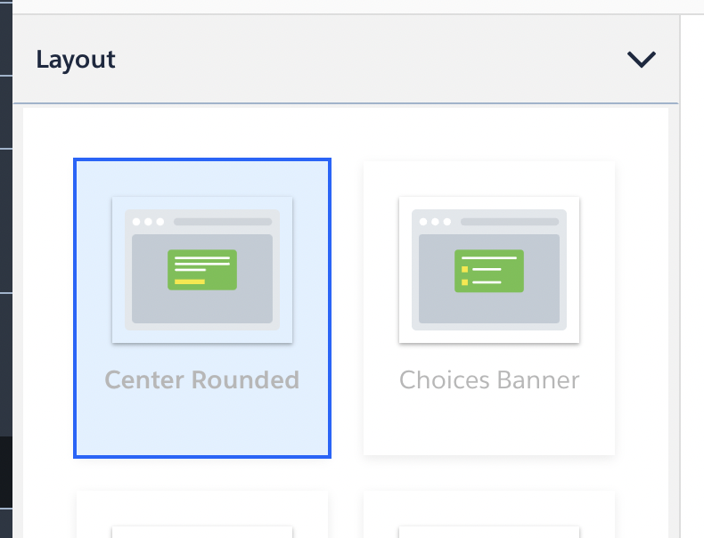
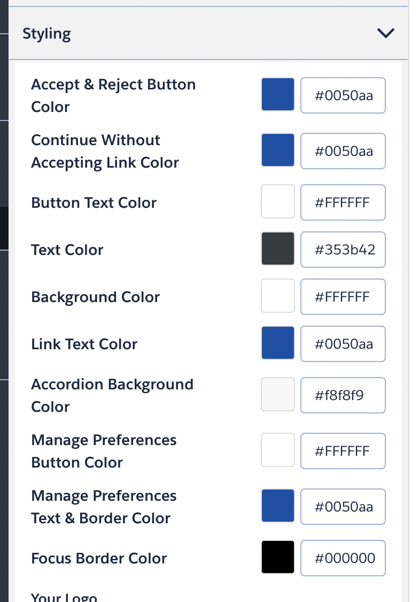
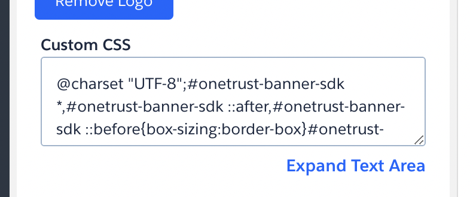

# OneTrust

<ContentRack
    fields='
        "preview": {
            "src": "examples/OneTrustExample.html",
            "type": "link"
        },
        "JS":{
            "src": "examples/cookieAlertOneTrust.js",
            "type": "content"
        }
    '
 />

> Please note that the JavaScript (in the `JS` tab) must be loaded on every website on which the Cookie Alert is loaded, additional to the JavaScript of OneTrust. Otherwise the button positioning is not the recommended one.

## Template

We added a Template in OneTrust named `CAKE v1 TCF2.0`, ready to use with all styles set.

### Copy template

If you cann't use our `CAKE v1 TCF2.0` template direktly copy the template to create your own. You will find `Copy Template` by clicking on the 3 dots at the end of the line from the `CAKE v1 TCF2.0` template.

### New template

If you have to create a new template from scratch please be clear to use the right framework. Our theme is created for `IAB Transparency and Consent Framework 2.0`, but it should be compatible with the most others.

#### Layout

After the initiation of the template please check the `Layout` setting, it should be set to `Center Rounded`.

#### Styling

In the `Styling` entry are a list of items with a corresponding color. The following table help you copy the correct values.

| color name | color value |
| ---------- | ----------- |
| Accept & Reject Button Color | #0050aa |
| Continue Without Accepting Link Color | #0050aa |
| Button Text Color | #FFFFFF |
| Text Color | #353b42 |
| Background Color | #FFFFFF |
| Link Text Color | #0050aa |
| Accordion Background Color | #f8f8f9 |
| Manage Preferences Button Color | #FFFFFF |
| Manage Preferences Text & Border Color | #0050aa |
| Focus Border Color | #000000 |

Below the colors you find a textarea labeled `Custom CSS`. Copy and past our CSS in there:

